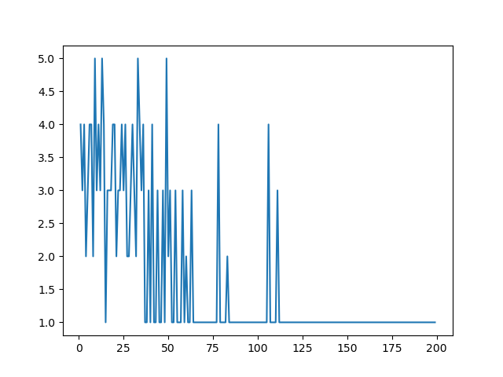

# Deep Reinforcement Learning for solving Peg Solitaire 🤖

In this project, I build a general-purpose Actor-Critic Reinforcement Learner and apply it to assorted instances of a puzzle type known as Peg Solitaire.
For a complete description of the game, see [Wikipedia](https://en.wikipedia.org/wiki/Peg_solitaire). 

An RL system consists of an agent and an environment, where the agent houses all of the core RL processes, while the environment contains everything else. The figures below provide a high-level view of the system that is implemented in this project. This system consists of the RL system (i.e. agent) composed of an actor and critic, and the SimWorld, which incorporates the environment and all knowledge about states and their relationships in that environment. As shown in the diagram, it may also house a structure representing the actual player of the game. 

The main file consists of pivot parameter values used to solve specied problems in the project description. The figures below shows the learning plot for the entire learning process and the visualization of the final episode. 

Learning plot           |  Visualization of last epiosde
:-------------------------:|:-------------------------:
  |  

